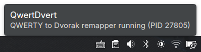

# QwertDvert

A Qwerty to Dvorak keyboard remapper for Linux with smart modifier key handling to keep Qwerty shortcuts. Makes use of the KDE tray for straightforward quitting.



## What It Does

Allows the user to type in the Dvorak layout, but when **Ctrl**, **Alt**, or **Super** (Win key) is held, the keyboard shortcuts work as if QWERTY is in use. This is desired because many familiar shortcuts are chosen for their physical positions on the keyboard rather than the letter.

The daemon assumes that the user has a QWERTY layout set on their system, and it monitors modifier key states and only remaps keys to Dvorak when no modifiers are held. This allows shortcuts to work with their original QWERTY positions while normal typing uses Dvorak layout.

## LLMs

Please note that this was built with the assistance of LLMs, including documentation. I don't know rust, and was curious to see how it could be used for this use case. It works very well for me but I cannot speak to its correctness.

The tray.rs and some other helper files are specific to KDE, but daemon.rs shoud be transferable to any Linux DE.

## Features

- Real-time keyboard remapping at the input device level
- Modifier-aware: shortcuts remain QWERTY-mapped for muscle memory
- System tray integration with toggle and quit controls
- Managed by systemd user services (proper lifecycle management)
- Rootless operation (no need to run as root)
- Automatic retry on startup if devices aren't ready yet

## Requirements

- Linux with KDE Plasma desktop environment
- Rust (2024 edition or later)
- systemd with user services support
- Kernel with evdev and uinput support (standard on most distros)

Tested on Fedora 43 with KDE Plasma.

## Installation

### Quick Install

```bash
cargo build --release
bash scripts/qwertdvert-manage.sh install
```

To enable autostart on login:

```bash
bash scripts/qwertdvert-manage.sh install --enable-autostart
```

### What Gets Installed

- Binaries: `~/qwertdvert/qwertdvert` and `~/qwertdvert/qwertdvert-tray`
- Systemd units: `~/.config/systemd/user/qwertdvert*.service`
- Desktop entry: `~/.local/share/applications/qwertdvert.desktop`
- Udev rule: `/etc/udev/rules.d/70-qwertdvert.rules` (requires sudo)

### Management Commands

```bash
bash scripts/qwertdvert-manage.sh status      # Check status
bash scripts/qwertdvert-manage.sh uninstall   # Remove everything
bash scripts/qwertdvert-manage.sh install --no-build  # Reinstall without rebuilding
```

### Manual Installation

If you prefer not to use the install script:

1. **Build and copy binaries**:
   ```bash
   cargo build --release
   mkdir -p ~/qwertdvert
   cp target/release/qwertdvert target/release/qwertdvert-tray ~/qwertdvert/
   ```

2. **Install systemd units**:
   ```bash
   mkdir -p ~/.config/systemd/user
   cp -a systemd/user/* ~/.config/systemd/user/
   systemctl --user daemon-reload
   ```

3. **Set up udev permissions** (required for rootless operation):
   ```bash
   sudo tee /etc/udev/rules.d/70-qwertdvert.rules >/dev/null <<'EOF'
   # Allow active user to access keyboard devices and uinput
   SUBSYSTEM=="input", KERNEL=="event*", ENV{ID_INPUT_KEYBOARD}=="1", TAG+="uaccess"
   KERNEL=="uinput", SUBSYSTEM=="misc", TAG+="uaccess"
   EOF
   
   sudo udevadm control --reload-rules
   sudo udevadm trigger
   ```

4. **Enable autostart** (optional):
   ```bash
   systemctl --user enable --now qwertdvert.target
   ```

## Usage

After installation, a system tray icon provides quick controls:
- **Toggle Remapping** - Enable/disable remapping on the fly
- **Quit** - Stop the service

Control via systemd (useful for debugging or scripting):
```bash
systemctl --user start qwertdvert.target    # Start
systemctl --user stop qwertdvert.target     # Stop
systemctl --user restart qwertdvert.target  # Restart
systemctl --user status qwertdvert.target   # Check status
```

View logs:
```bash
journalctl --user -u qwertdvert-daemon.service -f
```

## Architecture

- **Daemon** (`qwertdvert`) - Grabs keyboard input via evdev, remaps keys, and emits via uinput
- **Tray** (`qwertdvert-tray`) - KDE StatusNotifierItem providing system tray control

Both services are managed by systemd user units for clean lifecycle management.

## Uninstallation

```bash
bash scripts/qwertdvert-manage.sh uninstall
```

## License

MIT License - See [LICENSE](LICENSE) file for details.

## Troubleshooting

### Viewing Logs

```bash
journalctl --user -u qwertdvert-daemon.service -f  # Daemon
journalctl --user -u qwertdvert-tray.service -f    # Tray
```

### Application Won't Start

After login, it can take a few seconds for uaccess permissions to be applied. Temporary errors like these are normal:
- `No compatible keyboard devices available yet; retrying…`
- `Failed to create uinput builder: Device not found.`

They should clear automatically once devices are ready. If the problem persists:
```bash
systemctl --user restart qwertdvert.target
```

### No Keyboard Remapping

Verify the daemon is running:
```bash
systemctl --user status qwertdvert-daemon.service
```

Check uinput permissions:
```bash
ls -l /dev/uinput
getfacl /dev/uinput  # Should show user:yourusername:rw- in ACL
```

### System Tray Icon Not Visible

Restart the tray service:
```bash
systemctl --user restart qwertdvert-tray.service
```

If still not working, restart Plasma shell and log out/in:
```bash
kquitapp6 plasmashell || kquitapp5 plasmashell
```

### Permission Errors

Ensure the uinput module is loaded:
```bash
sudo modprobe uinput
```

Verify the udev rule exists and is correct:
```bash
cat /etc/udev/rules.d/70-qwertdvert.rules
```

Reapply udev rules and log out/in:
```bash
sudo udevadm control --reload-rules
sudo udevadm trigger
```
